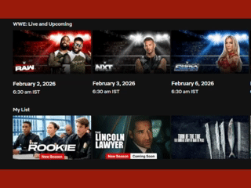

# Movie Ratings Extension

A Chrome extension that displays IMDb and Rotten Tomatoes ratings when you hover over movie and TV show posters on streaming platforms.

 

## Demo



[Watch full video demo](assets/demo.mp4)

## Features

- **IMDb Ratings** - See the IMDb score (e.g., 7.3/10)
- **Rotten Tomatoes** - See the Tomatometer percentage with fresh/rotten indicator
- **Hover to View** - Ratings appear when you hover over any movie poster
- **Smart Caching** - Ratings are cached for 7 days to minimize API calls
- **Non-intrusive** - Clean, minimal overlay that doesn't block content

## Supported Platforms

- Netflix (more platforms coming soon)

## Installation

### Step 1: Download the Extension

```bash
git clone https://github.com/niketansrane/movie-ratings-extension.git
```

Or download and extract the ZIP file from this repository.

### Step 2: Get an OMDb API Key

1. Go to [OMDb API](https://www.omdbapi.com/apikey.aspx)
2. Select the **FREE** tier (1,000 requests/day)
3. Enter your email and submit
4. Check your email and activate your API key

### Step 3: Load the Extension in Chrome

1. Open Chrome and navigate to `chrome://extensions/`
2. Enable **Developer mode** (toggle in the top-right corner)
3. Click **Load unpacked**
4. Select the `movie-ratings-extension` folder you downloaded

### Step 4: Configure Your API Key

1. Click the extension icon in Chrome's toolbar
2. Enter your OMDb API key in the settings popup
3. Click **Save**

## Usage

1. Go to [Netflix](https://www.netflix.com)
2. Hover over any movie or TV show poster
3. Wait briefly (~300ms) for the rating badges to appear
4. Ratings display at the top-left corner of the poster

### Rating Badges

| Badge | Meaning |
|-------|---------|
| **IMDb 7.3** | IMDb rating out of 10 |
| **RT 85%** (red) | Rotten Tomatoes "Fresh" (60%+) |
| **RT 45%** (gray) | Rotten Tomatoes "Rotten" (<60%) |

If no ratings are available, no badge is shown.

## Extension Popup

Click the extension icon to:

- **Enable/Disable** - Toggle the extension on or off
- **Update API Key** - Change your OMDb API key
- **View Stats** - See cache statistics and API usage

## Troubleshooting

### Ratings not appearing?

1. **Check API Key** - Click the extension icon and verify your API key is saved
2. **Check Console** - Open DevTools (F12) and look for `[Netflix Ratings]` logs
3. **Refresh Page** - After installing or updating, refresh the Netflix page
4. **Extension Enabled** - Make sure the toggle in the popup is ON

### "Extension context invalidated" error?

This happens when the extension is updated or reloaded. Simply refresh the Netflix page.

### API limit reached?

The free OMDb tier allows 1,000 requests/day. Ratings are cached for 7 days, so normal usage stays well under this limit.

## Development

### Project Structure

```
movie-ratings-extension/
├── manifest.json           # Extension configuration
├── src/
│   ├── background/
│   │   └── service-worker.js   # API calls and caching
│   ├── content/
│   │   ├── content.js      # DOM interaction and overlay
│   │   └── styles.css      # Rating badge styles
│   └── popup/
│       ├── popup.html      # Settings UI
│       ├── popup.js        # Settings logic
│       └── popup.css       # Popup styles
├── icons/                  # Extension icons
└── generate-icons.js       # Icon generation script
```

### Generate Icons

```bash
node generate-icons.js
```

## License

MIT

## Contributing

Contributions are welcome! Feel free to open issues or submit pull requests.
